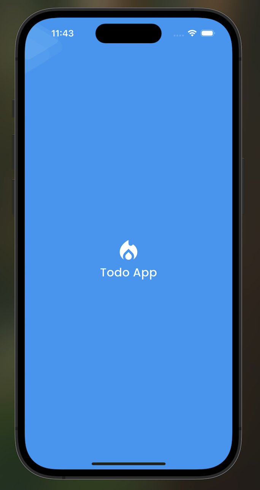
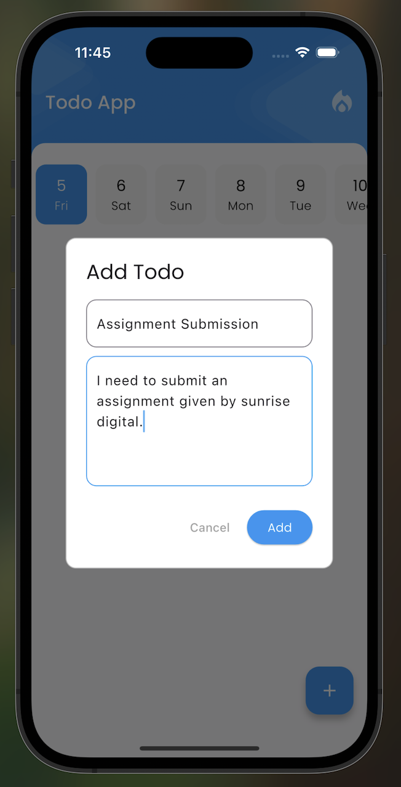
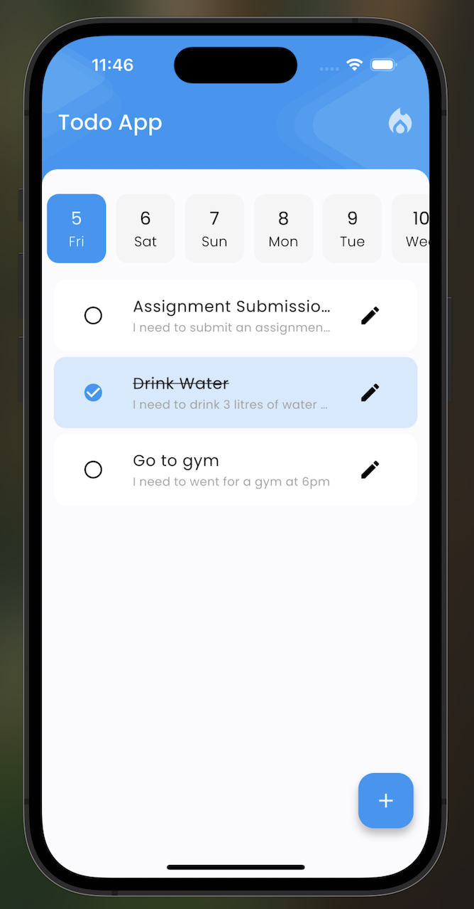
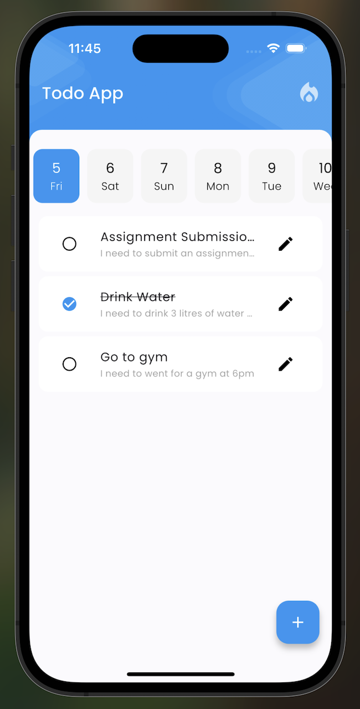
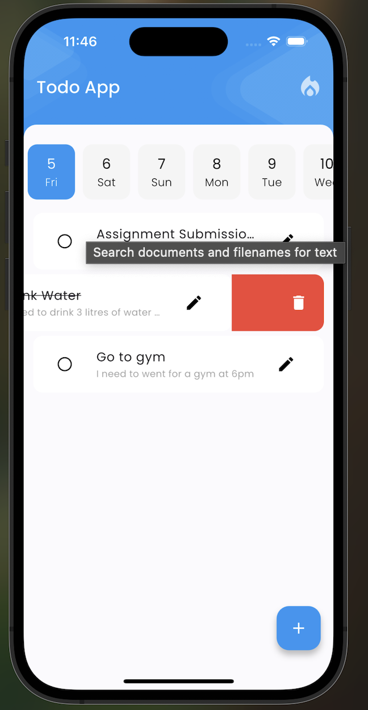

# Flutter Todo App Assignment

This is a **Flutter Todo App** assignment given by **Sunrise Digital, Bangalore**.

The app allows users to:

- **Create Todos**  
- **Update Todos**  
- **Delete Todos**  

Additionally, the project includes:

- Implementation of **Widgets and Unit Tests**  
- Clean and organized **Flutter architecture**

---

## Screenshots

### Home Screen


### Add Todo Screen


### Update Todo Screen


### Todo List Screen


### Test Results / Additional Screen


---

## Features

- **Add Todo:** Add new tasks with title and description.  
- **Update Todo:** Modify existing tasks.  
- **Delete Todo:** Remove tasks you no longer need.  
- **Unit Tests & Widget Tests:** Ensures the app works as expected.  

---

## Getting Started

1. **Clone the repository**

```bash
git clone <your-repo-url>
